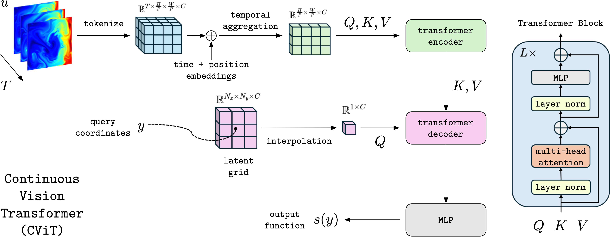

# Continuous Vision Transformer (CViT)




This repository contains code and data accompanying the manuscript titled [Bridging Operator Learning and Conditioned Neural Fields: A Unifying Perspective](https://arxiv.org/abs/2405.13998)

## Abstract

Operator learning is an emerging area of machine learning which aims to learn mappings between infinite dimensional function spaces. Here we uncover a connection between operator learning architectures and conditioned neural fields from computer vision, providing a unified perspective for examining differences between popular operator learning models. We find that many commonly used operator learning models can be viewed as neural fields with conditioning mechanisms restricted to point-wise and/or global information. Motivated by this, we propose the Continuous Vision Transformer (CViT), a novel neural operator architecture that employs a vision transformer encoder and uses cross-attention to modulate a base field constructed with a trainable grid-based positional encoding of query coordinates. Despite its simplicity, CViT achieves state-of-the-art results across challenging benchmarks in climate modeling and fluid dynamics. Our contributions can be viewed as a first step towards adapting advanced computer vision architectures for building more flexible and accurate machine learning models in the physical sciences.


## Installation

First install the required dependencies by running the following commands:

```
pip3 install -U pip
pip3 install --upgrade jax jaxlib
pip3 install --upgrade -r requirements.txt
```

Then install the `cvit` package by running the following command:

```
git clone https://github.com/PredictiveIntelligenceLab/cvit.git
cd cvit
pip install -e .
```


## Experiments

### Advection 

Further instructions and details on the training and evaluation of the models can be found [here](./adv/README.md).

### Shallow Water 

Further instructions and details on the training and evaluation of the models can be found [here](./swe/README.md).

### Navier-Stokes 

Further instructions and details on the training and evaluation of the models can be found [here](./ns/README.md).


## Checkpoints

Checkpoints for our best models on each benchmark are available [here](https://drive.google.com/drive/folders/1XcyzV8yEx0xu_fT6QbRTccIytP0hyNft?usp=sharing).
To restore the trained models, download the checkpoints and place them in the respective benchmark directory, e.g., `swe/` or `ns/`.


## Citation
    @article{wang2024bridging,
      title={Bridging Operator Learning and Conditioned Neural Fields: A Unifying Perspective},
      author={Wang, Sifan and Seidman, Jacob H and Sankaran, Shyam and Wang, Hanwen and Pappas, George J and Perdikaris, Paris},
      journal={arXiv preprint arXiv:2405.13998},
      year={2024}
    }


