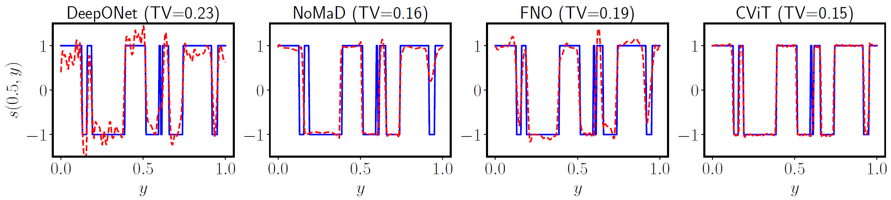

# 1D Advection

This directory contains the code to train and evaluate models on the 1D advection dataset. Make sure to install the requirements by running `pip install -r requirements.txt` from the root folder of this repository.

## Data

The data can be obtained from [here](https://github.com/Zhengyu-Huang/Operator-Learning/tree/main/data). Make sure to update the path of `data_dir` (line 40) in `loaders.py` to point to the directory containing the data.

## Training

To train the model on the advection_1d dataset, run the following command:

```bash
python modelname_train.py # where modelname is one of the following: deeponet, nomad, fno, cvit
```

This will train the model and save the best model to `./model_states/modelname.pickle`.

## Evaluation

To evaluate the model on the advection_1d dataset, run the following command:

```bash
python modelname_test.py
```

This will load the best model from `./model_states/modelname.pickle` and evaluate it on the test set, and output the results to `./model_outputs/modelname.h5`.

## Results

In the previous step, the results are saved to `./model_outputs/modelname.h5`. To visualize the results, run the jupyter notebook `plot.ipynb` which will load the results and plot them. We state the obtained error metrics below.

### Using Relative L2 Error

| Model    |      Mean |    Median |      Max |
|:---------|----------:|----------:|---------:|
| NOMAD    | 0.032787  | 0.0246571 | 0.1741   |
| DeepONet | 0.0574771 | 0.0454819 | 0.232457 |
| FNO      | 0.0408418 | 0.0310558 | 0.191958 |
| CViT     | 0.0335431 | 0.0275473 | 0.152318 |


### Using TV

| Model    |      Mean |    Median |      Max |
|:---------|----------:|----------:|---------:|
| NOMAD    | 0.032787  | 0.0246571 | 0.1741   |
| DeepONet | 0.0574771 | 0.0454819 | 0.232457 |
| FNO      | 0.0408418 | 0.0310558 | 0.191958 |
| CViT     | 0.0335431 | 0.0275473 | 0.152318 |


## Visualizations


