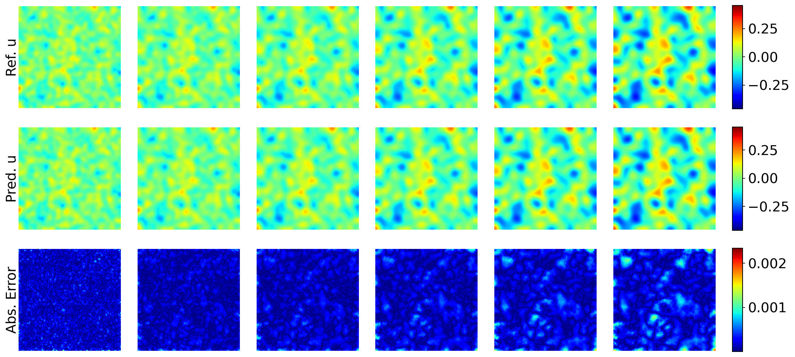
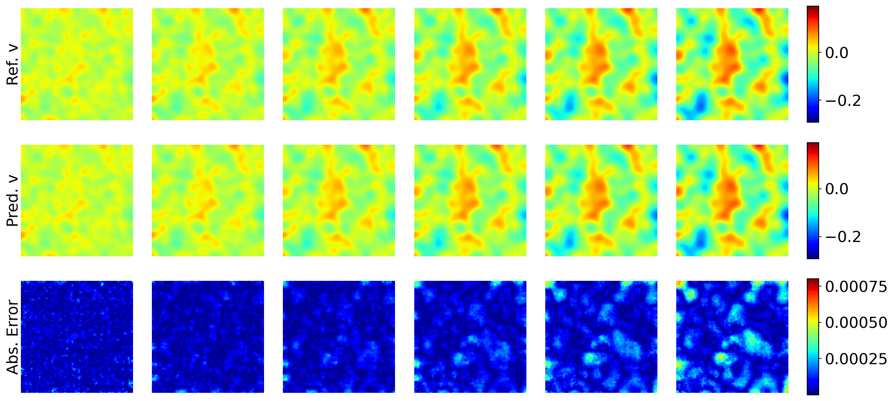

# 2D Diffusion-Reaction Equation

This directory contains the code to train and evaluate models on the 2D diffusion-reaction equation benchmark.


## Download datasets 

Use the following link to download the datasets for the Diffusion-Reaction benchmark:

https://darus.uni-stuttgart.de/file.xhtml?fileId=133017&version=1.0


## Training and Evaluation

Make sure you are in the `dr` directory before running the following commands and the path to the data is correctly specified in the config file.

To train the model,
specify the GPU and config and run the following command

```CUDA_VISIBLE_DEVICES=0 python3 main.py --config=configs/cvit_l.py```

To evaluate the model, specify the GPU and config and run the following command

```CUDA_VISIBLE_DEVICES=0 python3 main.py --config=configs/cvit_l.py --config.mode=eval```


## Results


| **Model**            | **# Params** | **Rel. $L^2$ error ($\downarrow$)** |
|----------------------|--------------|-------------------------------------|
| FNO                  | 0.5 M        | 12.00%                              |
| FFNO                 | 1.3 M        | 5.71%                               |
| GK-T                 | 1.6 M        | 3.59%                               |
| GNOT                 | 1.8 M        | 3.11%                               |
| Oformer              | 1.9 M        | 1.92%                               |
| DPOT-Ti              | 7 M          | 3.21%                               |
| MPP-S                | 30 M         | 1.12%                               |
| DPOT-S               | 30 M         | 3.79%                               |
| MPP-L (Pre-trained) | 400 M        | 0.98%                               |
| DPOT-L (Pre-trained) | 500 M        | 2.32%                               |
| DPOT-L (Fine-tuned)  | 500 M        | 0.73%                               |
| DPOT-H (Pre-trained) | 1.03 B       | 1.91%                               |
| **CViT-S**           | 13 M         | **1.13%**                           |
| **CViT-B**           | 30 M         | **1.11%**                           |
| **CViT-L**           | 92 M         | **0.68%**                           |

## Visualizations

The following figures show the predictions of the CViT-L model







