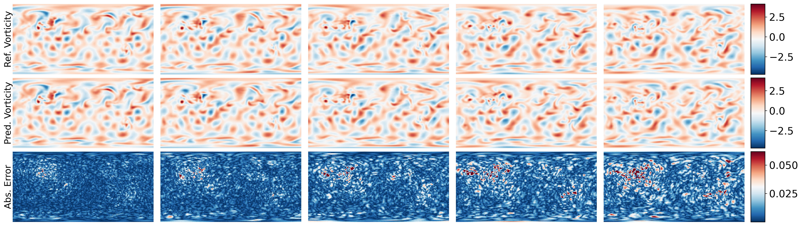
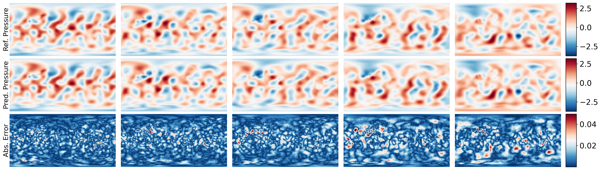

# 2D Shallow water equation

This directory contains the code to train and evaluate models on the 2D shallow water equation.


## Download datasets

The data of PDEArena is currently hosted on Huggingface: https://huggingface.co/pdearena. 
Detailed instructions on how to download the data can be found [here](https://pdearena.github.io/pdearena/datadownload/)


SSH:
```
# Make sure you have git-lfs installed (https://git-lfs.com)
git lfs install
git clone git@hf.co:datasets/pdearena/ShallowWater-2D

# if you want to clone without large files – just their pointers
# prepend your git clone with the following env var:
GIT_LFS_SKIP_SMUDGE=1
```

HTTPS:
```
# Make sure you have git-lfs installed (https://git-lfs.com)
git lfs install
git clone https://huggingface.co/datasets/pdearena/NavierStokes-2D

# if you want to clone without large files – just their pointers
# prepend your git clone with the following env var:
GIT_LFS_SKIP_SMUDGE=1
```


## Training and Evaluation

Make sure you are in the `ns` directory before running the following commands and the path to the data is correctly specified in the config file.

To train the model,  specify the GPU and config and run the following command:

```CUDA_VISIBLE_DEVICES=0 python3 main.py --config=configs/cvit_8x8.py```

To evaluate the model, specify the GPU and config and run the following command

```CUDA_VISIBLE_DEVICES=0 python3 eval.py --config=configs/cvit_8x8.py```


## Results


| **Model**                   | **# Params** | **Rel. $L^2$ error ($\downarrow$)** |
|-----------------------------|--------------|-------------------------------------|
| DilResNet                   | 4.2 M        | 13.20%                              |
| $\text{U-Net}_{\text{att}}$ | 148 M        | 5.684%                              |
| FNO                         | 268 M        | 3.97%                               |
| U-F2Net                     | 344 M        | 1.89%                               |
| UNO                         | 440 M        | 3.79%                               |
| **CViT-S**                  | 13 M         | **4.47%**                           |
| **CViT-B**                  | 30 M         | **2.69%**                           |
| **CViT-L**                  | 92 M         | **1.56%**                           |  


## Visualizations

The following figures show the predictions of the CViT-L model on the 2D shallow water equation.


### Voriticity field



### Pressure field



